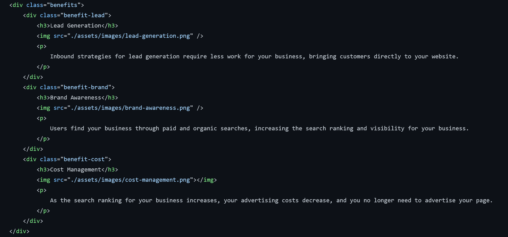

# Code Refactor Starter Code

# Weekly Challenge  1

In this Weekly challenge we were assigned some starter code to refractor so that it has accessabilty attributes. Good accessabilty tags enable a webpage to have a better chance of being showcased by browsers and search engines

<h1>Changes made</h1>
    <ol>
<li>Added semantic HTML</li>
<li>Restructered to follow logical order</li>
<li>Added image alt tags</li>
<li>Removed div tags with more accessible alternatives</li>
<li>Restructered heading attribute</li>
<li>Fixed links to function properly</li>
<li>Added comments to css and html file</li>
<li>Added specific id elements</li>
<li>Added descriptive title</li>
</ol>
 

 
<h1>Before and after comparison</h1>

<h2>After</h2>

<h3>Contact</h3>

<li><a href="https://github.com/AbdalehHersi">Github</li>
<li>therealhersi03@gmail.com</li>

